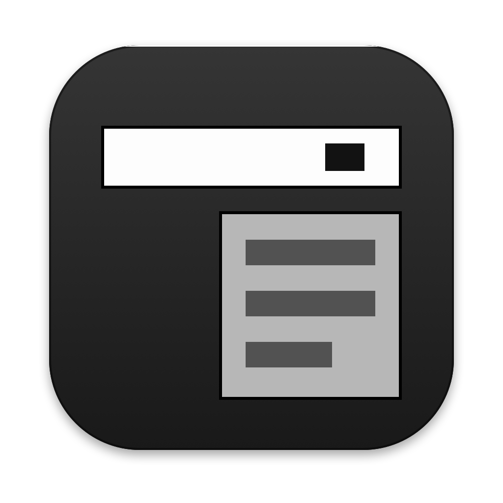

# OpenCode Status Bar

A small macOS menu bar item that shows what the [OpenCode](https://opencode.ai) desktop app,
and optionally Codex and Claude Code, are doing.
Check it while you work in other apps to see whether your agents are still working, have finished,
or are waiting for you to approve something or answer a question.

This is a fork of [OpenClaudeAgent/opencode-monitor](https://github.com/OpenClaudeAgent/opencode-monitor)
(MIT licensed, now archived). It is a community project, not an official OpenCode product.

## What You'll See

The menu bar shows an icon and a short status, combined across OpenCode,
[Codex](https://github.com/openai/codex) and [Claude Code](https://code.claude.com) (each in its
desktop app or a terminal session). The icon turns yellow only when any of them needs you;
otherwise the icon and text follow your menu bar's light or dark appearance, like other menu bar
items.

| Status | Icon | Meaning |
|---|---|---|
| `Working...` | Terminal | One session is working, in any of the apps |
| `2 working`, `3 working`, ... | Terminal | Several sessions are working, added up across all apps |
| `Done` | Checkmark | A session finished within the last minute, and nothing is working |
| `Awaiting approval` | Hand (yellow) | An app is waiting for you to approve a request |
| `Awaiting answer` | Question mark (yellow) | OpenCode or Claude Code asked you a question |
| `Needs attention` | Exclamation mark (yellow) | An approval and a question are both pending |
| `Agents idle` | Terminal | At least one app is running, with no recent activity |
| `Agents offline` | Terminal | None is running (OpenCode counts only once it has loaded the plugin) |

Anything that needs you comes first, then working, then done, then idle. Counts are sessions
(conversations), not sub-agents or open windows. Codex and Claude Code count as running while
their desktop app is open, even if you only use the Claude app for chat.

Click the item for a dropdown with **Show OpenCode**, **Show Codex** and **Show Claude** (each
brings that app to the front, or opens it), an **OpenCode**, a **Codex** and a **Claude Code**
section listing each recent session and what it's waiting for, **Refresh**, and **Quit**. The
Codex and Claude Code sections appear only while those apps run.

## Requirements

- macOS (tested on macOS 26 with an Apple silicon Mac)
- The OpenCode desktop app, version 2 (tested with 2.0). For OpenCode 1, see
  [Which Version to Install](#which-version-to-install).
- [uv](https://docs.astral.sh/uv/): `brew install uv`
- Xcode Command Line Tools: `xcode-select --install`

## Which Version to Install

OpenCode 2 changed how plugins work, so each major version of OpenCode needs its own version of
the plugin. The menu bar app itself is the same in both.

| Your OpenCode version | Install from         | Clone command                                                                      |
| --------------------- | -------------------- | ---------------------------------------------------------------------------------- |
| 2.x                   | `main`               | `git clone https://github.com/haoyangzhang99/OpenCodeStatusBar.git`                |
| 1.x                   | `opencode-v1` branch | `git clone -b opencode-v1 https://github.com/haoyangzhang99/OpenCodeStatusBar.git` |

To check your OpenCode version, select OpenCode in Finder's Applications folder and choose
File > Get Info, or run:

```sh
defaults read /Applications/OpenCode.app/Contents/Info.plist CFBundleShortVersionString
```

With the wrong version, OpenCode's sessions never appear: the menu bar stays on `Agents offline`
(or `Agents idle` while Codex or Claude Code runs), and the dropdown shows `No OpenCode instances`.

The `opencode-v1` branch is the last release that supports OpenCode 1, and new features are only
added to `main`.

### Moving from OpenCode 1 to OpenCode 2

After OpenCode updates to version 2, switch the project folder to `main`:

```sh
cd OpenCodeStatusBar
git fetch
git checkout main
git pull
./install.sh
```

Then fully quit OpenCode (Cmd+Q) and reopen it.

## Install

For OpenCode 2:

```sh
git clone https://github.com/haoyangzhang99/OpenCodeStatusBar.git
cd OpenCodeStatusBar
./install.sh
```

For OpenCode 1, use `git clone -b opencode-v1 ...` instead (see
[Which Version to Install](#which-version-to-install)).

The installer:

1. Installs Python 3.12 and the app's two dependencies in `.venv` inside this folder.
2. Builds `~/Applications/OpenCode Status Bar.app` and checks that it starts correctly.
3. Adds the plugin `~/.config/opencode/plugins/opencode-status-bar.js`, which loads
   `integrations/opencode-status-bar.js` from this folder.
4. If Codex is installed, adds hooks to `~/.codex/hooks.json` that run
   `integrations/opencode-status-bar-codex.py` from this folder. Your other hooks are left as
   they are, and the original file is backed up once to `hooks.json.bak-opencode-status-bar`.
5. If Claude Code is installed, adds hooks to `~/.claude/settings.json` that run
   `integrations/opencode-status-bar-claude.py` from this folder. Your other hooks and settings
   are left as they are, and the original file is backed up once to
   `settings.json.bak-opencode-status-bar`.
6. Opens the app.

Then **fully quit OpenCode (Cmd+Q) and reopen it** so it loads the plugin. Until then the
dropdown shows `No OpenCode instances`. From then on, **OpenCode opens the status bar app whenever
it starts**, so you don't need to launch it yourself.

**For Codex, trust the new hooks once:** Codex skips new hooks until you review them. Start a
new Codex session, run `/hooks`, and trust the OpenCode Status Bar hooks. Codex sessions that
were already open load hooks only when they start. After that, starting a Codex session also
opens the status bar app.

**Claude Code needs no extra step:** it picks up the new hooks on its own. Sessions that were
already open report their status from their next prompt. Starting a Claude Code session also
opens the status bar app.

Keep the project folder where it is: the app, plugin, and hooks run from it. If you move the
folder, run `./install.sh` again, then trust the updated Codex hooks in `/hooks`.

To stop OpenCode, Codex and Claude Code from opening the app, run
`mkdir -p ~/.config/opencode-status-bar && touch ~/.config/opencode-status-bar/no-autolaunch`.
Delete that file to turn it back on.

## Update

```sh
git pull
./install.sh
```

Restart OpenCode afterwards if the plugin changed. `git pull` stays on the version you
installed; to move from OpenCode 1 to 2, see
[Moving from OpenCode 1 to OpenCode 2](#moving-from-opencode-1-to-opencode-2).

## Uninstall

```sh
./uninstall.sh          # removes the app, plugin, Codex and Claude Code hooks, and status files
./uninstall.sh --purge  # also removes logs and .venv
```

Then restart OpenCode to unload the plugin, and delete this folder if you no longer need it.

## How It Works

OpenCode's desktop app protects its local server with a password that changes every launch,
so outside programs can't query it directly. Instead, a small OpenCode plugin runs inside
OpenCode and every 2 seconds writes a status snapshot for each open project to
`~/.config/opencode-status-bar/bridge/`. The menu bar app reads those files and never
connects to OpenCode.

- Snapshots older than 15 seconds, or from an OpenCode process that has exited, are ignored.
- Finished sessions stay listed for 60 seconds, which is how `Done` appears.
- Approval and question states come from OpenCode's own request events (approvals are also
  checked against its pending list), not timing guesses.
- The plugin on `main` is written for OpenCode 2; OpenCode 1 users install the `opencode-v1`
  branch instead.
- When OpenCode starts, the plugin opens the menu bar app in the background (once per OpenCode
  launch). If you quit the app, it stays closed until OpenCode starts again.
- For Codex, hooks run on each Codex event (prompt submitted, tool started or finished, approval
  requested, turn finished or interrupted, session started or ended) and write one status file
  per Codex session to `~/.config/opencode-status-bar/codex/`. Sessions of a Codex process that
  has exited are ignored.
- Claude Code works the same way, with status files in `~/.config/opencode-status-bar/claude/`.
  Its hooks also report failed turns, questions Claude asks you, and Claude Code's "idle for a
  minute" notification.

Technical details are in [`integrations/README.md`](integrations/README.md).

## Privacy

- **Stays on your Mac.** The app makes no network requests.
- **Written by the plugin:** session IDs, titles, project folder paths, and status flags.
  **Written by the Codex and Claude Code hooks:** session IDs, project folder paths, the app's
  process ID, and status flags. Files are readable only by your user account.
- **Not written:** prompts, messages, tool names, inputs or output, API keys, or OpenCode's
  server password.
- **Logs** (`~/Library/Logs/OpenCodeStatusBar/`) get one line per status change, with counts
  only: no session titles or paths.

## Limitations

- macOS only. Made for the OpenCode desktop app; the terminal version of OpenCode is untested.
- The plugin reads approvals and questions through an internal part of OpenCode's plugin client,
  so a future OpenCode update could break those two indicators.
- Codex sends no event when a turn fails with an error, so a failed Codex turn shows as working
  until its next event, or for at most 15 minutes. Waiting for approval has no time limit.
- Codex hook events don't identify individual approval requests, so if Codex runs tools in
  parallel, finishing one tool can hide another tool's pending approval. Claude Code has the
  same limit when a parallel tool finishes, though a tool merely starting doesn't hide it.
- Claude Code sends no event when you press Esc, so an interrupted Claude Code turn shows as
  working (or waiting) for about a minute, until its idle notification arrives.
- On a crowded menu bar, macOS may hide the item behind the notch. Hold Command and drag it
  further right.
- The app links against the Python that `install.sh` set up. If you delete uv's Python
  installations, run `./install.sh` again.

## Development

```sh
uv sync                                  # includes test dependencies
uv run pytest tests/ -q                  # Python tests
make test                                # Python and plugin tests
```

After changing Python code, quit the app from its menu and reopen it. After changing the plugin,
restart OpenCode.

See [DEVELOPMENT.md](DEVELOPMENT.md) for the project layout, running from source, and debugging.

The original project's dashboard, analytics database, security scanner, local API server, and
Claude usage tracking were removed in this fork. They remain available in the
[original repository](https://github.com/OpenClaudeAgent/opencode-monitor) and in this
repository's Git history.

## Credits and License

Based on [opencode-monitor](https://github.com/OpenClaudeAgent/opencode-monitor) by OpenClaudeAgent.
MIT License; see [LICENSE](LICENSE).
